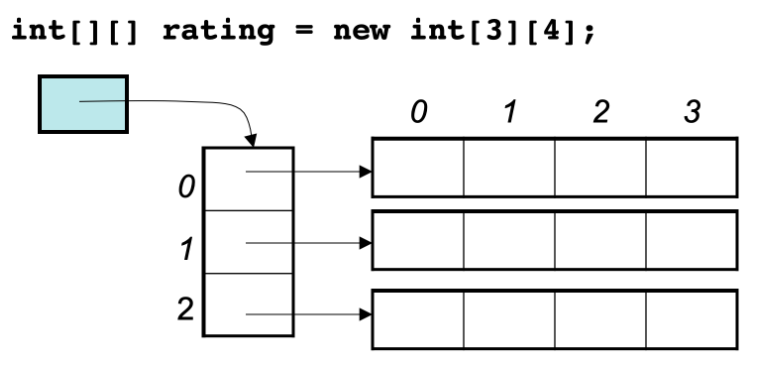

# Tóm tắt kiến thức về mảng

- **Mảng là tập hợp các dữ liệu cùng loại được lưu nối tiếp nhau trong không gian bộ nhớ.**

Mảng có thể được truy cập thông qua chỉ số của phần tử đó. Có 2 điều cần quan tâm:
- Chỉ số mảng bắt đầu từ 0
- Địa chỉ của các phần tử trong bộ nhớ là nối tiếp nhau.

Do địa chỉ nối tiếp nhau, chúng ta không thể tránh khỏi việc thay đổi địa chỉ của các phần tử khác khi thực hiện việc thêm, bớt phần tử.

Khi dùng C++, nên chú ý đến khác biệt giữa mảng và vector. Implementation bên dưới của vector là mảng. Nhưng vector khác mảng do vector là container.

- **Phần tử trong mảng không thể bị xóa, chỉ có thể bị ghi đè**

Kể cả khi chúng ta định nghĩa mảng hai chiều thì trong bộ nhớ vẫn được sắp sếp nối tiếp nhau.
```cpp
void test_array(){
    int array[2][3] = {
        {0, 1, 2},
        {3, 4, 5}
        };
    for (int i = 0; i< 2; i++){
        for (int j = 0; j < 3; j++)
            cout << &array[i][j] << endl;
    }

}
int main()
{
    test_array();
}
```
Địa chỉ được in ra
`
0x7ffee4065820 0x7ffee4065824 0x7ffee4065828
0x7ffee406582c 0x7ffee4065830 0x7ffee4065834
`
Do kiểu int trong máy tính được biểu diễn bằng 4 bytes nên địa chỉ có dạng như trên, địa chỉ ở trên được viết dưới định dạng hexa (hệ 16) do đó `8+4=c`, 


- Trong java không có con trỏ và việc quản lý địa chỉ được thực hiện bởi java virtual machine
```java
public static void test_arr() {
    int[][] arr = {{1, 2, 3}, {3, 4, 5}, {6, 7, 8}, {9,9,9}};
    System.out.println(arr[0]);
    System.out.println(arr[1]);
    System.out.println(arr[2]);
    System.out.println(arr[3]);
}
```
- Địa chỉ của chúng không nối tiếp nhau và đây không phải là địa chỉ thực.



