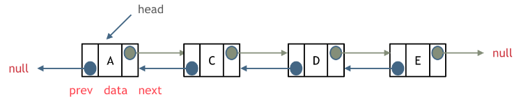
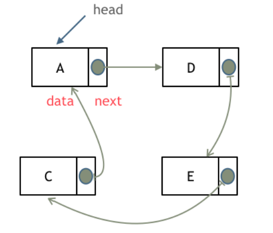
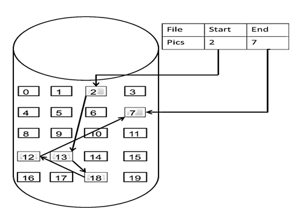
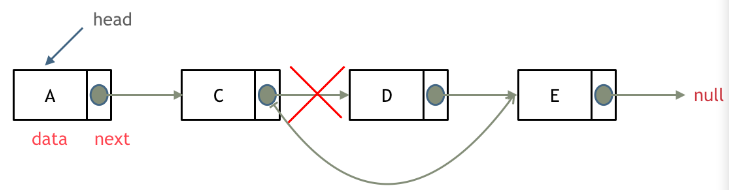
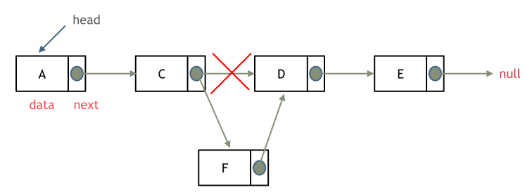

# Danh sách liên kết

Danh sách liên kết là một cấu trúc tuyến tính được kết nối với nhau theo chuỗi bằng con trỏ. Mỗi node bao gồm 2 phần, trường dữ liệu và trường con trỏ (lưu con trỏ trỏ đến node tiếp theo). Trường cont rỏ của node cuối cùng trong danh sách trỏ đến null (null pointer).


## Phân loại danh sách liên kết

### Danh sách liên kết đơn (Single list)

Danh sách liên kết chúng ta vừa đề cập chính là danh sách liên kết đơn.

### Danh sách liên kết kép (Double linked list)

Với danh sách liên kết kép mỗi node có 2 trường con trỏ, một con trỏ đến node tiếp theo và một con trỏ đến node trước đó.



### Danh sách liên kết vòng (Circular linked list)

Danh sách liên kết vòng là một danh sách liên kết có kết nối tạo thành 1 vòng khép kín.

Danh sách liên kết vòng có thể được sử dụng để giải bài toán Joseph cycle problem.



## Cách danh sách liên kết được lưu trữ

Khác với mảng được lưu trữ liên tiếp trong bộ nhớ, linked list không được lưu trữ như vậy.



Các node được kết nối với nhau qua con trỏ, và con trỏ sẽ trỏ đến vùng nhớ chứa node tiếp theo. Dẫn đến các node này sẽ rải rác trong bộ nhớ máy tính (tìm hiểu thêm về heap memory allocation để biết rõ hơn).

## Định nghĩa/Implement danh sách liên kết

```c++
struct ListNode {
    int val;
    ListNode *next;
    ListNode(int x) : val(x), next(NULL) {}
};
```

## Các thao tác với danh sách liên kết đơn

### Xóa node



Chỉ cần chuyển con trỏ trỏ đến node sau node bị xóa.

Tuy nhiên trong ngôn ngữ như C++ cần nhớ xóa node D nếu không sẽ dẫn đến memory leak, còn các ngôn ngữ khác như java, python thì không cần.

### Them node mới



1. Tạo node mới F, con trỏ trỏ đến node D.
2. Trỏ con trỏ C đến node mới.

Ta có thể thấy thao tác thêm, xóa là thao tác có độ phức tạp `O(1)`. Tuy nhiên thao tác tìm kiếm sẽ có độ phức tạp `O(n)`.

## Phân tích hiệu năng

Nếu mảng đã được định nghĩa, việc thay đổi độ dài của mảng đồng nghĩa ta phải tạo lại mảng với độ dài mới.

Ngược lại đối với linked list ta có thể thay đổi độ dài tùy muốn bằng cách thêm, xóa. Dẫn đến cấu trúc này phù hợp với kiểu dữ liệu không cố định yêu cầu thường xuyên thêm xóa.
