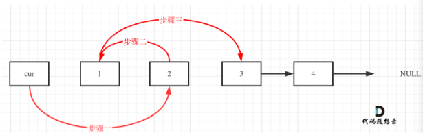

# 24 Hoán đổi 2 nodes theo cặp

Cho một danh sách liên kết, hãy hoán đổi các node theo từng cặp cạnh nhau. Phải giải mà không được thay đổi giá trị của các node trong danh sách liên kết (chỉ có các node được thay đổi)

Example
`Input: head = [1, 2, 3, 4]`
`Output: [2, 1, 4, 3]`

Example 2:
`Input: head = []`
`Output: []`

Example 3:
`Input: head=[1]`
`Output: [1]`

## Hướng giải

Đối với bài kiểu này, nên sử dụng node head ảo sẽ thuận tiện hơn. Nếu không thì ta sẽ phải thực hiện head node riêng.

Bước tiếp theo đó là thay đổi 2 node liền kề
Ta cần vẽ hình minh họa vì rất dễ gặp sai sót.

